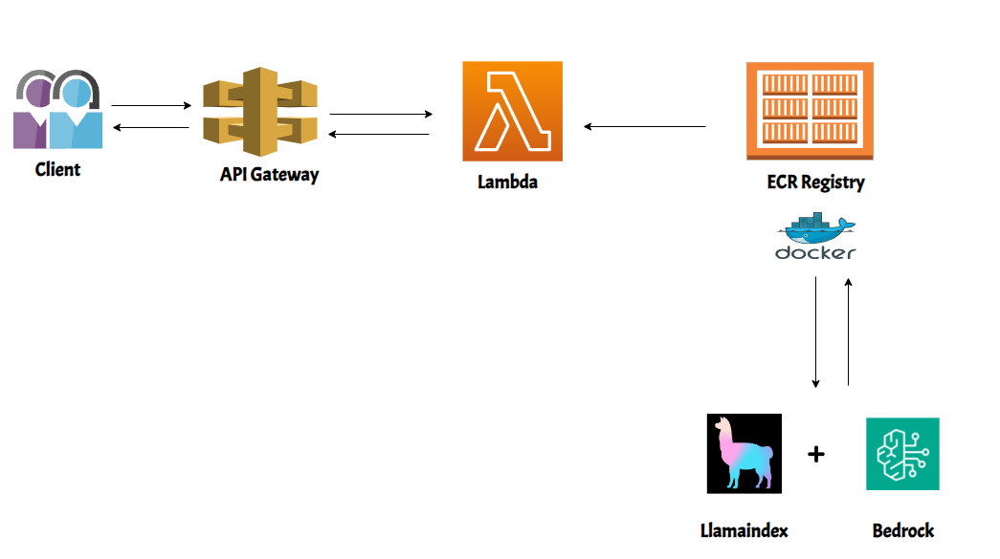

# Llamaindex Chat Assistant with Bedrock, ECR, API Gateway and Lambda

[](https://emoji.gg/emoji/8708-aws)

This project shows how to deploy a llamaindex chat assistant on AWS.




1. **Create a repository on AWS ECR**

   ```bash
   aws ecr create-repository --repository-name llamaindex_chatassistant
   ```

2. **Build the Docker Image**

   ```bash
   docker build -t my-llamaindex-chat-assistant-image .
   ```


3. **Authenticate Docker with AWS ECR** 

    Authenticate your Docker CLI to the Amazon ECR registry where your repository is located. Replace [region_name] and [account_id] with your actual AWS region and account ID.

    ```bash
    aws ecr get-login-password --region [region_name] | docker login --username AWS --password-stdin [account_id].dkr.ecr.[region_name].amazonaws.com
    ```

4. **Tag the Docker Image**

    Tag your Docker image so that it can be pushed to the ECR repository. Replace [region_name] and [account_id] with your AWS region and account ID.

    ```bash
    docker tag my-llamaindex-chat-assistant-image:latest [account_id].dkr.ecr.[region_name].amazonaws.com/llamaindex_chatassistant:latest
    ```

5. **Push the Docker Image to ECR**

    Finally, push the tagged image to your ECR repository:

    ```bash
    docker push [account_id].dkr.ecr.[region_name].amazonaws.com/llamaindex_chatassistant:latest
    ```

6. **Create the lambda function on the console and define your own event and test it!**